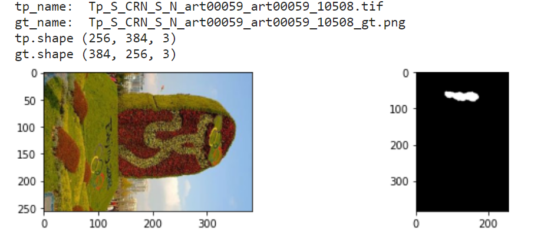
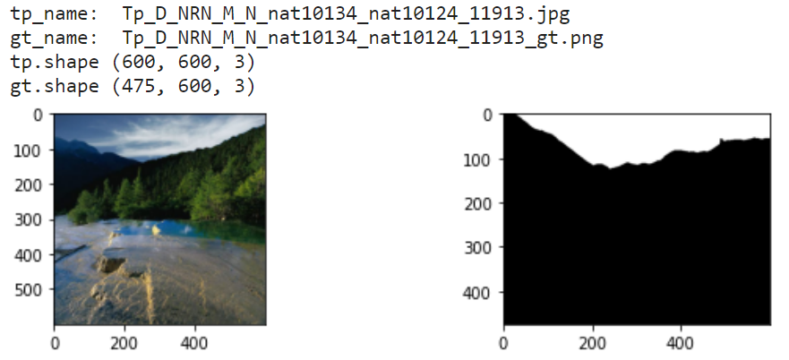

# Noisy Labels repairing in dataset CASIA v2.0 groundtruth
   [](https://GitHub.com/Sunnyhaze) 

This repository includes resources below:
- **CASIA2.0** Image Tampering Detection Evaluation Dataset
- It's ground-truth which **repaired some of Noisy label-masks.**

> Owner of this repository is a colledge student now, if my tiny contribution helps you, please give me a star⭐ and explain the problem to other scientific researchers, which can help me a lot. Thanks! 
## Intro
CASIA 2.0 is a dataset for Image Tampering Detection Evaluation, which was published by Jing Dong et al in 2013. However, this dataset is **lack of the groundtruth images** comparing to other Image Tampering Detection Datasets.

To soleving the problem, Nam Thanh Pham et al. generated the corresponding Groundtruth in a 2019 paper contributed it to Github. This publicly available groundtruth has gained wide distribution in data science platforms such as kaggle
> Nam Thanh Pham et al. also corrected some mistakes in naming the files of the origianl CAISA 2.0 Dataset.
## Noisy Labels in wide spread groundtruth
However, when we doing experiments base on CASIA 2.0 datasets, we found that there are some<font color ="red"><b> serious noises</b></font> in groundtruth such as :
- Rotation mismatch
- Resolution mismatch
- Mask boundary mismatch

Here are some Examples:
- Rotation mismatch example on Kaggle platform:
  - 
- Another Rotation mismatch example:
  - 
- Resolution mismatch example:
  - 

Because `resize()` is generally used in pre-processing, these dozens of problematic images are difficult to be detected from more than 5000 tampered images.

What's more, this dataset is widly use in the field of Image Tampering Detection to eavaluate model performance, and it's hard to find a second groundtruth dataset on the Internet, we have reason to believe that many papers have adopted this groundtruth as the validation of the CASIA 2.0 dataset.

## Fixed groundtruth downloading
Although these images can hardly have a significant impact on the training results of a dataset containing more than 5,000 images, we thought it would be useful to point out this issue for researchers to know. 

And here we place the Google Drive link of [corrected CASIA 2.0 dataset and it's ground truth ZIP file](https://drive.google.com/file/d/1JN93ts7VxJ4bbJL9TlE9uxM3ZeYuCN9M/view?usp=sharing), you can **DOWNLOAD** it through the link above.

Files in the ZIP are organized as follows:
```bash
├───Au          # Authentic images
├───Tp          # Tampered images
└───Gt          # Groundtruth images
```

## Cite

You can visit [Nam Thanh Pham's CASIA 2.0 Groundtruth Github repo](https://github.com/namtpham/casia2groundtruth) to check their original Groundtruth. 

______

If you use the groundtruth dataset for **a scientific publication,** please cite the following papers:

* CASIA dataset

        @inproceedings{Dong2013,
        doi = {10.1109/chinasip.2013.6625374},
        url = {https://doi.org/10.1109/chinasip.2013.6625374},
        year = {2013},
        month = jul,
        publisher = {{IEEE}},
        author = {Jing Dong and Wei Wang and Tieniu Tan},
        title = {{CASIA} Image Tampering Detection Evaluation Database},
        booktitle = {2013 {IEEE} China Summit and International Conference on Signal and Information Processing}
        }


 * CASIA groundtruth dataset 
 
        @article{pham2019hybrid,
        title={Hybrid Image-Retrieval Method for Image-Splicing Validation},
        author={Pham, Nam Thanh and Lee, Jong-Weon and Kwon, Goo-Rak and Park, Chun-Su},
        journal={Symmetry},
        volume={11},
        number={1},
        pages={83},
        year={2019},
        publisher={Multidisciplinary Digital Publishing Institute}
        }